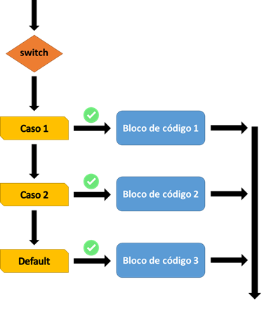

# JavaScript: switch

A estrutura condicional switch permite executar um bloco de código diferente de acordo com cada opção (cada case) especificada.

## Visão geral
O uso do switch é indicado quando os valores a serem analisados nessas condições são pré-definidos.

Considerando o seguinte código:

let tipoUsuario = 'Gerente'
```
switch (tipoUsuario) {
  case 'Admin':
    mensagem = '*|*| Feliz Natal, chefe! |*|*';
    break
  case 'Gerente':
    mensagem = 'Boas festas, meu amigo!';
    break
  default:
    mensagem = 'Boas festas!';
}
```
O valor atribuído à variável mensagem será: "Boas festas, meu amigo!". A Figura 1 demonstra o funcionamento do condicional switch.

switch
 
 
Figura 1. Funcionamento da estrutura condicional switch.

## Sintaxe
```
switch(expressao){
  case n1:
    [bloco de código 1]
    break;
  case n2:
    [bloco de código 2]
    break;
  case [...n]:
    [bloco de código 2]
    break;
 default:
   [bloco de código 3]
}
```
* **expressao** - expressão a ser comparada com cada case declarado dentro do switch. Caso o valor obtido na expressão seja a igual ao que for declarado no case, o bloco de código é executado.
* **case** - valor que será comparado à expressão.
* **break** - palavra reservada que finaliza a execução do switch. Caso não especificada no final do bloco de código em execução, as linhas dos blocos de código seguintes também serão executadas.
* **default** - é a palavra reservada que define o bloco de código a ser executado se nenhum dos cases atenderem à expressão declarada no switch.

## Na prática

### Exemplo 1: Exibindo diferentes alimentos de acordo com a necessidade do usuário
No exemplo a seguir demonstramos como exibir diferentes alimentos de acordo com a necessidade do usuário:
´´´
let alimento = 'Gordura'

switch (alimento) {
  case 'Proteína':
    mensagem = 'Carne, leite, aveia, amêndoas';
    break;
  case 'Carboidrato':
    mensagem = 'Banana, batata doce, feijão, pão';
    break;
  default:
    mensagem = 'Cuidado com a alimentação!';
}
´´´
O valor atribuído a mensagem é: "Cuidado com a alimentação!".

### Exemplo 2: o uso do break não é necessário?
Neste exemplo demonstramos que o uso do break não é necessário, porém ao não declará-lo e a depender da lógica de negócio, um erro pode ser inserido no projeto.
```
let cargo = 'gerente'
let salario = 2000

switch (cargo) {
  case 'gerente':
    salario *= 1.15;
  case 'supervisor':
    salario *= 1.10;
  default:
    salario *= 1.05;
}
```
O valor atribuído a salario é 2.656,50. A ausência do break em cada bloco de código faz com que o código declarado dentro de cada case seja executado independentemente do case atender à condição especificada no switch.

### Exemplo 3: Quando ausência do break evita a escrita de linhas de código desnecessárias
No exemplo a seguir demonstramos uma situação em que a ausência do break evita a escrita de linhas de código desnecessárias:
```
let mes = 'Maio'

switch (mes) {
  case 'Janeiro':
  case 'Fevereiro':
  case 'Março':
    console.log('Verão!');
    break;
  case 'Abril':
  case 'Maio':
  case 'Junho':
    console.log('Outono!');
    break;
  case 'Julho':
  case 'Agosto':
  case 'Setembro':
    console.log('Inverno!');
    break;
  case 'Outubro':
  case 'Novembro':
  case 'Dezembro':
    console.log('Primavera!');
}
```
O valor impresso no console é "Outono".

### Exemplo 4: customizando uma mensagem de boas-vindas
No exemplo a seguir demonstramos como customizar uma mensagem de boas-vindas com switch:
```
let sexo = 'feminino'

switch (sexo) {
  case 'feminino':
    console.log('Bem-vinda!');
    break;
  case 'masculino':
    console.log('Bem-vindo!');
  default:
    console.log('por favor informar um sexo valido: feminino/masculino');
}
```
O valor impresso no console é "Bem-vinda!".

### Exemplo 5
No exemplo a seguir demonstramos como obter o nome do mês a partir do seu respectivo número com switch:
```
let mes = 4;
let nomeMes = ''

switch (mes) {
  case 1:
    nomeMes = 'Janeiro';
    break;
  case 2:
    nomeMes = 'Fevereiro';
    break;
  case 3:
    nomeMes = 'Março';
    break;
  case 4:
    nomeMes = 'Abril';
    break;
  case 5:
    nomeMes = 'Maio';
    break;
  case 6:
    nomeMes = 'Junho'
    break
  case 7:
    nomeMes = 'Julho';
    break;
  case 8:
    nomeMes = 'Agosto';
    break;
  case 9:
    nomeMes = 'Setembro';
    break;
  case 10:
    nomeMes = 'Outubro';
    break;
  case 11:
    nomeMes = 'Novembro';
    break;
  case 12:
    nomeMes = 'Dezembro';
    break;
  default:
    nomeMes = 'Mês inexistente';
}

console.log(nomeMes)
```
O valor impresso no console é "Abril". Caso o valor seja diferente dos especificados em cada case, é impresso "Mês inexistente".

Fonte: https://www.devmedia.com.br/javascript-switch/41016
